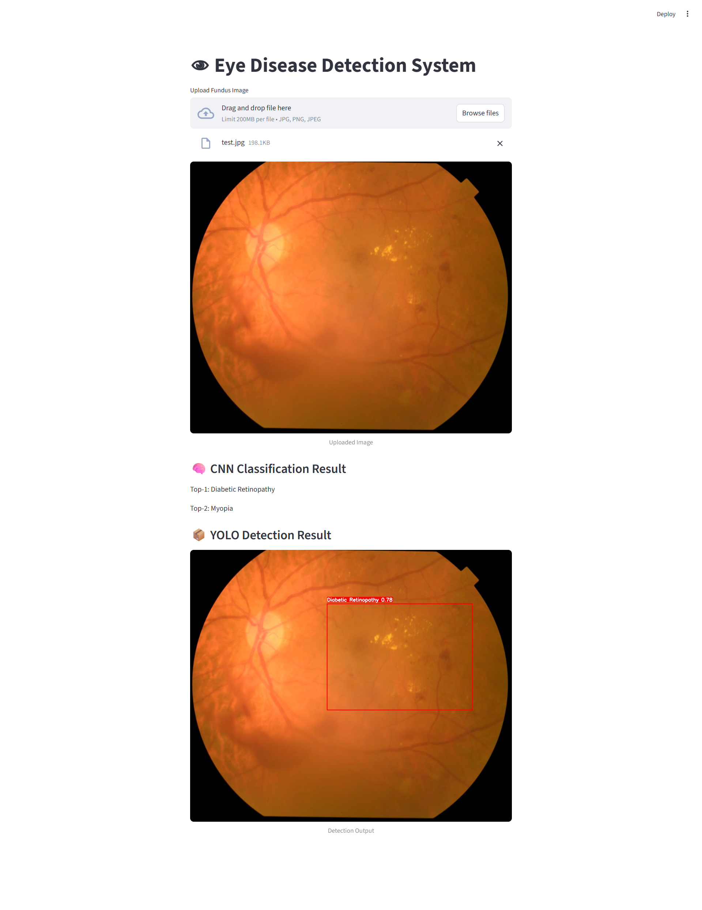

# Eye Disease Detection using Deep CNN & YOLOv11

**An intelligent system for automated classification and localization of eye diseases from retinal fundus images.**



*Streamlit Web Application Interface - Real-time Eye Disease Detection*

## Project Overview

This project develops a **unified deep learning pipeline** that combines high-accuracy multi-class classification using CNN, explainable AI through Grad-CAM heatmaps, and weakly supervised object detection using YOLOv11.

The system can classify retinal images into multiple eye disease categories and localize the affected regions — making it highly useful for computer-aided diagnosis.

## ✨ Key Results

- **Top-1 Accuracy**: 82.77%
- **Top-2 Accuracy**: 97.75%
- **YOLOv11 Detection**: Strong localization performance (mAP \~0.85)
- **Macro Average F1-Score**: [Add your value]

## 🔥 Features

- Multi-class classification of various eye diseases
- Disease localization using bounding boxes
- Automatic pseudo bounding box generation from Grad-CAM
- Model evaluation and visualization scripts
- Ready-to-use inference and web application
- Comprehensive training and evaluation pipelines

## 🛠️ Technologies Used

- **Framework**: PyTorch
- **Classification**: Custom CNN / EfficientNet
- **Detection**: YOLOv11 (Ultralytics)
- **Explainability**: Grad-CAM
- **Visualization**: Matplotlib, OpenCV
- **Web App**: Streamlit (`app.py`)
- **Others**: scikit-learn, Albumentations, Pillow

## 📁 Project Structure

```bash
EYE DISEASE - COPY/
├── dataset/                  # Original and processed dataset
├── models/                   # Saved model weights
├── checkpoints/              # Training checkpoints
├── runs/                     # YOLO training runs
├── demo_images/              # Sample outputs and visualizations
├── tools/                    # Utility scripts
├── venv/                     # Virtual environment
├── app.py                    # Web Application (Streamlit)
├── train_cnn.py              # CNN Training script
├── evaluate_model.py         # Model evaluation
├── predict_all.py            # Batch prediction
├── box_from_gradcam.py       # Pseudo bounding box generation
├── gradcam_visualize.py      # Grad-CAM visualization
├── yolo11n.pt                # YOLO base model
├── requirements.txt
├── README.md
└── .gitignore